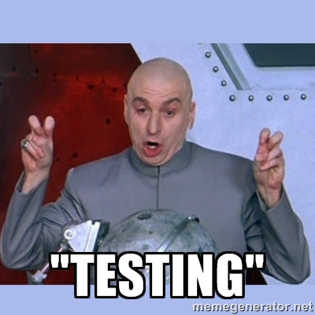
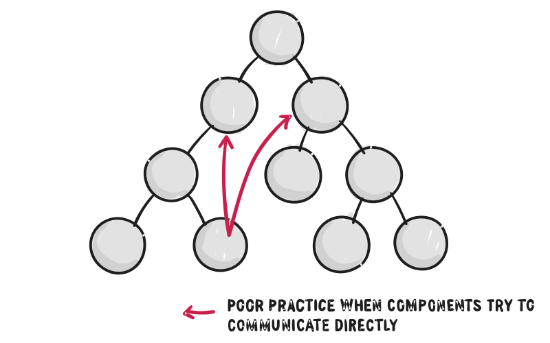
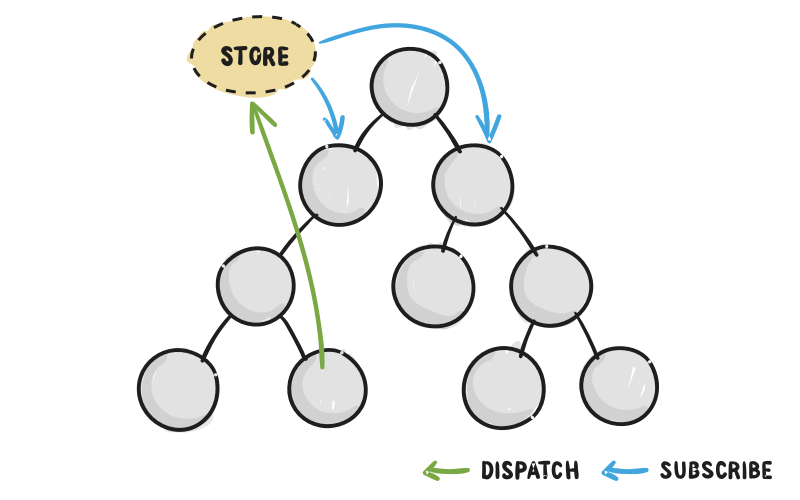
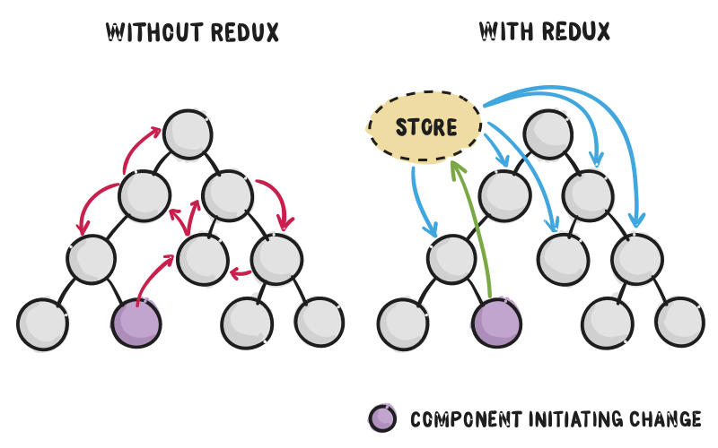

build-lists:true
## Welcome to
# [fit]Testing _**Vuex**_

---

# Requirements

- Basic Javascript knowledge
- Basic understanding on how **Vue.js** works
- Basic Javascript Testing knowledge

---

# What we will learn

---



- What is Vuex
- How does Vuex work 
- Testing Vuex getters
- Testing Vuex mutation
- Testing Vuex actions

- In a *real world* example.

---

# But wait...

---

# What is ... _**Vuex**_ _?_ 🤔

---

# Vuex is a **state management pattern & framework**.

Inspired by facebooks flux pattern and *redux* implementation of it.

---

# [fit] What is a __*"State Management Pattern"*__ and why do we need it? 

---

# Simple Vue App

```javascript
new Vue({
  // state
  data () {
    return {
      count: 0
    }
  },
  // view
  template: `
    <div>{{ count }}</div>
  `,
  // actions
  methods: {
    increment () {
      this.count++
    }
  }
})
```


---

# Simple **one-way data flow**


---

# But ...

A complex application have different components, with child components and looks more like this.




---

# Flux Pattern for the rescue



---



---

# We need this for _**Vue.js!**_

---


---

## [fit]And this is. 
# [fit]*Vuex*

---

# [fit]Our Test Application

(demo)

---


# Advanced Action Testing

---

Actions can be tricky, if you interact with external APIs / Services.

---

So we need to **mock** the endpoints.

---

# Example action

```javascript

// actions.js
import shop from '../api/shop'

export const getAllProducts = ({ dispatch }) => {
  dispatch('REQUEST_PRODUCTS')
  shop.getProducts(products => {
    dispatch('RECEIVE_PRODUCTS', products)
  })
}
```

---

# Testing action with inject loader

```javascript

// use require syntax for inline loaders.
// with inject-loader, this returns a module factory
// that allows us to inject mocked dependencies.

const actionsInjector = require('inject!./actions')

// create the module with our mocks
const actions = actionsInjector({
  '../api/shop': {
    getProducts (cb) {
      setTimeout(() => {
        cb([ /* mocked response */ ])
      }, 100)
    }
  }
})

```

---

# Testing it

```javascript
describe('actions', () => {
  it('getAllProducts', done => {
    testAction(actions.getAllProducts, [], {}, [
      { type: 'REQUEST_PRODUCTS' },
      { type: 'RECEIVE_PRODUCTS', payload: { /* mocked response */ } }
    ], done)
  })
})
```